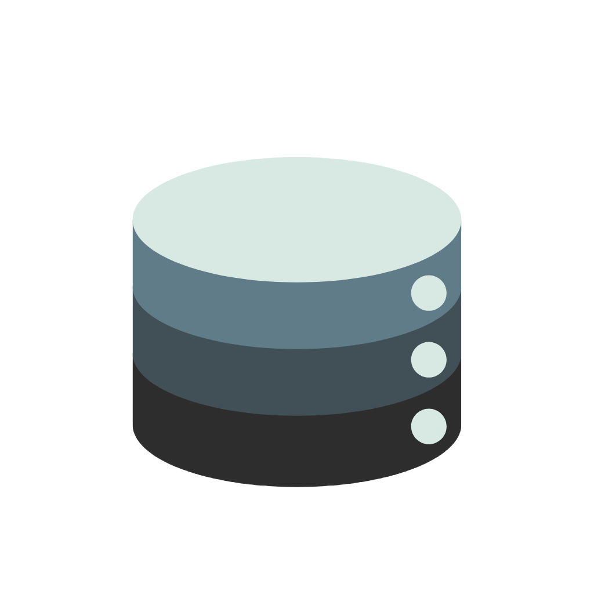

<div align="center">



# BreakNWipe

**A one-click solution to *Break* the data through randomized encryption and *Wipe* it leaving no traces behind.**

[](docs/CHANGELOG.md)
[](LICENSE)
[](https://www.python.org/)
[](#)
[](#%EF%B8%8F-user-interfaces)
[](#-blockchain-verification)
[](#-standards-compliance)
[](#-about-the-project)

</div>

---

## 🏆 About the Project

BreakNWipe was built for **Smart India Hackathon 2025** by **Team CodeBreakers!**

| | |
|---|---|
| **Problem Statement ID** | SIH25070 |
| **Problem Statement** | Secure Data Wiping for Trustworthy IT Asset Recycling |
| **Theme** | Miscellaneous |
| **Category** | Software |
| **Team ID** | 65891 |
| **Team Name** | CodeBreakers! |

### The Problem

India generates over **1.75 million tonnes of e-waste annually**. A key barrier to responsible recycling is the fear of data breaches, which leads to over **₹50,000 crore worth of IT assets** being hoarded instead of properly recycled. BreakNWipe builds trust in the recycling ecosystem by making data sanitization verifiable, standards-compliant, and simple enough for the general public.

### Why We're Different

BreakNWipe doesn't just overwrite data — it uses a three-layer defense:

1. **🔐 Randomized Encryption Algorithm (REA)** — data is first encrypted on-the-fly with randomized keys and multi-chain encryption, making it *unreadable*
2. **🔑 Secure Key Destruction** — encryption keys are destroyed, making the data *undecryptable*
3. **📝 Overwriting** — one of seven industry-standard overwrite algorithms makes the data *unrecoverable*

And the result isn't just a wiped drive — it's **proof anyone can independently verify**: a digitally signed PDF/JSON certificate with a QR code, anchored on a public blockchain.

## ⚙️ How It Works

```
   PRE-WIPE                      WIPING                        POST-WIPE
┌─────────────────┐   ┌───────────────────────────┐   ┌────────────────────────┐
│ Launch software │   │ Quick Wipe: 1-pass        │   │ PDF / JSON report      │
│ Detect drives & │ → │  one-click for the public │ → │ Blockchain + QR proof  │
│ hidden areas    │   │ Deep Wipe: REA encryption │   │ Third-party verifiable │
│ (HPA/DCO/bad    │   │  + multipass overwrite    │   │ Device safe to discard │
│  blocks)        │   │  (7 algorithms)           │   │ Data 100% irrecoverable│
└─────────────────┘   └───────────────────────────┘   └────────────────────────┘
```

## ✨ Features

### ✅ Implemented

#### Wiping Engine
- [x] **7 overwrite algorithms** — NIST Clear, NIST Purge, DoD 3-Pass, DoD 7-Pass, Gutmann 35-Pass, Random, Zero-fill (+ fully custom)
- [x] **REA Cryptographic Erase** — `rea-basic`, `rea-multichain`, `rea-extreme`, `rea-fast`, `rea-custom` (randomized encryption + key destruction + overwrite)
- [x] **Hardware-level erasure** — ATA Secure Erase and NVMe Sanitize/Format commands
- [x] **Read-back verification** of wiped data with per-block validation
- [x] **Dry-run mode** for safe testing

#### Device Support
- [x] HDDs, SATA SSDs, NVMe drives, USB flash drives and memory cards
- [x] **Hidden area detection** — HPA (Host Protected Area) and DCO (Device Configuration Overlay) via `hdparm`
- [x] Android device wiping via **ADB** (encrypts before factory reset — stronger than a plain factory reset)
- [x] Drive temperature monitoring during long wipes

#### Certification & Verification
- [x] **Digitally signed PDF certificates** (RSA / X.509)
- [x] **JSON reports** for automated processing
- [x] **QR codes** for instant verification
- [x] **Blockchain anchoring** — certificates stored on Ethereum Sepolia via the `ReportRegistryWithJson` smart contract
- [x] **Online QR verification** through the [datawipe webapp](https://datawipe.vercel.app) (scan → cross-check on blockchain → tamper-proof report)
- [x] Audit-trail logging to a local database

#### User Interfaces
- [x] **Interactive CLI wizard** for beginners (`--interactive`)
- [x] **Expert CLI mode** with full command-line control
- [x] **Web GUI** — FastAPI + WebSocket interface with real-time progress, speed, and ETA (`--gui`)
- [x] **Batch processing** of multiple devices from a config file
- [x] `.deb` / `.rpm` package build scripts and system installer

### 🚧 Planned / Not Yet Implemented

- [ ] **EDL mode wiping** for Qualcomm chipsets (requires QFIL integration)
- [ ] **SP Flash Tool mode** for MediaTek chipsets
- [ ] **Odin download mode** for Samsung chipsets
- [ ] **Bootable ISO/USB** — standalone offline wiping environment (custom OS)
- [ ] **Windows support** (currently Linux-only)
- [ ] **Multilingual UI** with localized labels
- [ ] **PyPI release** (`pip install breaknwipe`)
- [ ] Resume capability for interrupted wipes
- [ ] Automated test suite with CI

## 🚀 Quick Start

### Installation

> **OS support:** the installer scripts (`quickstart.sh`, `install_dependencies.sh`, `install.sh`, and `make install-system`) target **Ubuntu/Debian on x86_64** — they shell out to `apt` for system packages (`hdparm`, `nvme-cli`, `smartmontools`, etc.) and check for `apt` up front, so they will refuse to run on Fedora/RHEL, Arch, macOS, or non-x86_64 hosts. `uv sync` / `pip install -e .` on their own are platform-agnostic (any Linux/macOS with Python), but you'll still need to provide `hdparm`/`nvme-cli`/`smartmontools` yourself via your distro's package manager for device-level operations to work.

**One-liner** (clones the repo and runs the full system installer — dedicated user, systemd service, `breaknwipe`/`bwipe` commands on PATH). As with any curl-to-bash installer, review the script before piping it into a root shell:

```bash
curl -fsSL https://raw.githubusercontent.com/41vi4p/BreakNWipe/main/scripts/quickstart.sh | sudo bash
```

**Or manually**, if you'd rather keep the checkout around for development:

```bash
# Clone the repository
git clone https://github.com/41vi4p/BreakNWipe.git
cd BreakNWipe

# Install system-level dependencies (hdparm, nvme-cli, smartmontools, uv itself, ...)
sudo ./scripts/install_dependencies.sh

# Then install Python dependencies with uv (creates a .venv from pyproject.toml/uv.lock)
uv sync

# Or install from source with pip instead of uv
pip install -e .
pip install -e ".[web,blockchain]"   # with optional extras

# Or full system-wide install (system deps + dedicated user + systemd service)
sudo make install-system
```

### Basic Usage

```bash
# Interactive mode (recommended for beginners)
sudo breaknwipe --interactive

# Launch the web GUI at http://127.0.0.1:8000
sudo breaknwipe --gui

# List available devices
sudo breaknwipe --list-devices

# Wipe with NIST Clear and generate a certificate
sudo breaknwipe wipe --device /dev/sdX --algorithm nist-clear --certificate

# Safety first: inspect the device and dry-run before wiping
sudo breaknwipe info /dev/sdX
sudo breaknwipe wipe --device /dev/sdX --algorithm nist-clear --dry-run
```

### Commands

| Command | Description |
|---------|-------------|
| `wipe` | Perform secure data wiping |
| `info <device>` | Display detailed device information |
| `list-algorithms` | Show available wiping algorithms |
| `batch` | Batch processing from a JSON/YAML config file |
| `verify-certificate` | Verify wipe certificate authenticity |

### Wiping Algorithms

| Algorithm | Passes | Description | Use Case |
|-----------|--------|-------------|----------|
| `nist-clear` | 1 | NIST SP 800-88 Clear | General purpose |
| `nist-purge` | 3 | NIST SP 800-88 Purge | High security |
| `dod-3pass` | 3 | DoD 5220.22-M | Government compliance |
| `dod-7pass` | 7 | Enhanced DoD | Maximum security |
| `gutmann` | 35 | Gutmann method | Legacy magnetic drives |
| `random` | Custom | Random data overwrite | Configurable security |
| `zeros` | 1 | Zero-fill | Quick sanitization |
| `custom` | Custom | User-defined patterns | Advanced users |
| `rea-*` | 1–7+ | Randomized Encryption Algorithm + overwrite | Deep Wipe (via Web GUI) |

## 🔗 Blockchain Verification

Every wipe certificate can be anchored on the **Ethereum Sepolia testnet**:

1. BreakNWipe completes the wipe and generates the signed certificate
2. The certificate hash (or full JSON) is stored on-chain via the `ReportRegistryWithJson` contract
3. A QR code embedding the blockchain reference is added to the PDF report
4. Anyone can scan the QR at **[datawipe.vercel.app](https://datawipe.vercel.app)** — the app queries the smart contract and displays the tamper-proof verification result

Setup details: [docs/BLOCKCHAIN_INTEGRATION.md](docs/BLOCKCHAIN_INTEGRATION.md)

```bash
# Configure your credentials (never commit the real .env!)
cp breaknwipe/.env.example breaknwipe/.env
cp blockchain/.env.example blockchain/.env
```

## 🏗️ Repository Structure

```
BreakNWipe/
├── breaknwipe/           # Python package
│   ├── wipe_engine/      #   Core wiping algorithms, REA, verification
│   ├── device/           #   Device detection, ATA/NVMe/mobile handlers
│   ├── certificate/      #   PDF/JSON certs, signatures, QR, blockchain
│   ├── cli/              #   Interactive & expert CLI, progress display
│   ├── web/              #   FastAPI server, WebSocket, session manager
│   └── logging/          #   Audit-trail logging service & database
├── blockchain/           # Hardhat project — ReportRegistryWithJson contract
├── frontend_ui/          # Web GUI static files (HTML/CSS)
├── docs/                 # Design docs, integration guides, SIH presentation
├── scripts/              # Install, packaging, demo & setup scripts
├── tests/                # Integration test scripts
├── Makefile              # Development commands (make help)
├── pyproject.toml        # Package metadata & dependencies (uv-managed)
└── setup.py              # No-op shim kept for `python setup.py sdist`
```

## 🏛️ Standards Compliance

- **NIST SP 800-88 Rev 1** — U.S. Federal media sanitization guidelines (Clear/Purge)
- **IEEE 2883:2022** — Standard for sanitization of storage
- **DoD 5220.22-M** — 3-pass and 7-pass overwrite variants
- **ISO/IEC 27040** — Storage security guidelines

## ⚠️ Important Warnings

- **💀 DATA DESTRUCTION** — all data on the target device is permanently destroyed
- **🔒 ROOT REQUIRED** — must run with `sudo` for direct device access
- **💾 UNMOUNT FIRST** — unmount filesystems before wiping
- **🔌 STABLE POWER** — ensure uninterrupted power during operation
- **💿 RAID ARRAYS** — handle RAID configurations with extreme care

## 🛠️ Development

```bash
git clone https://github.com/41vi4p/BreakNWipe.git
cd BreakNWipe
uv sync             # installs deps + dev tools (pytest, black, flake8, mypy, isort)

make help          # All development commands
make lint          # uv run flake8 + mypy
make format        # uv run black + isort
make test          # uv run pytest with coverage

# Add/remove a dependency
uv add <package>
uv add --dev <package>
```

For the smart contract:

```bash
cd blockchain
pnpm install
npx hardhat test
```

Further reading: [docs/DESIGN.md](docs/DESIGN.md) · [docs/BLOCKCHAIN_INTEGRATION.md](docs/BLOCKCHAIN_INTEGRATION.md) · [docs/CHANGELOG.md](docs/CHANGELOG.md) · [SIH 2025 Presentation](docs/CodeBreakers_SIH25_PS1.pdf)

## 👥 Team CodeBreakers

| Member | Contribution |
|--------|-------------|
| **Blaise Rodrigues** (Team Lead) | Algorithms, Testing & Architecture Design |
| **David Porathur** | CLI Utility, Features Integration & Architecture Design |
| **Vanessa Rodrigues** | Next.js App, Research & Architecture Design |
| **Natasha Lewis** | UI & Research |
| **Chris Lopes** | Next.js App with digital signature verification |
| **Anastasia Lopes** | UI, Frontend & Research |

## 🌟 Impact

- **♻️ Reduce e-waste hoarding** by building user confidence in data destruction
- **🔄 Promote the circular economy** through safe device recycling and resource recovery (gold, copper, lithium, rare-earth metals)
- **🇮🇳 Support Digital India & Atmanirbhar Bharat** environmental goals
- **🏢 Enable secure ITAD** for financial services, healthcare, defense, and government
- **🤝 Create trust** in the recycling ecosystem — aligned with UN SDGs 9 & 13

## 📄 License

This project is licensed under the **GNU General Public License v3.0** — see the [LICENSE](LICENSE) file for details.

```
BreakNWipe - Secure Data Wiping for Trustworthy IT Asset Recycling

This program is free software: you can redistribute it and/or modify
it under the terms of the GNU General Public License as published by
the Free Software Foundation, either version 3 of the License, or
(at your option) any later version.
```

---

<div align="center">

**🇮🇳 Made for India's e-waste solution | 🌍 Promoting the global circular economy**

**Developed with ❤️ by Team CodeBreakers — Smart India Hackathon 2025**

</div>
